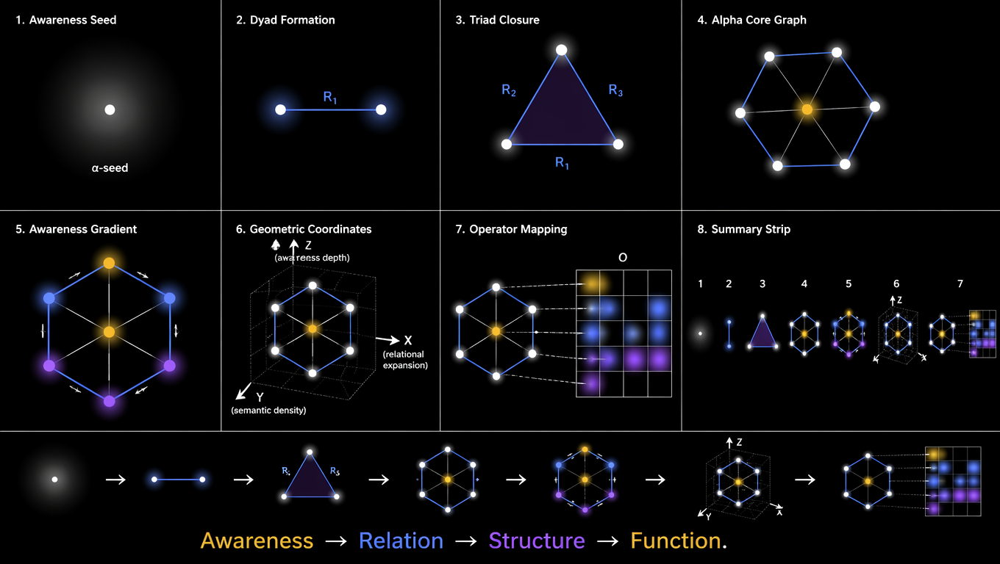
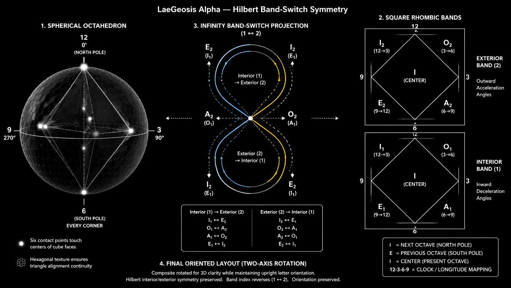

I prepared CoPilot for the task to create this gallery with me:

# Preparation

> https://github.com/tambetvali/laGEOsis/tree/main/EveryStepOfYourWay - we are going to illustrate laGEOsis graphically, in mathematical steps. I describe you every step, you create 1.2 page Creen AI image generation description in md code block, illustrating it with awareness: https://github.com/tambetvali/laGEOsis/blob/main/Alpha/README.md - awareness in it's Alpha state for laGEOsis: in-text LaeGeosis, which is the actual codename (laGEOsis comes from: I have the actual repo names from some artistic pursuit, a minimum I can do: I add some artistic twist to repostitory names, because those are *unique identifiers*, rather than *concrete categories and terms* which appear inside, already identified by their repository: this is how Logos work and Logos - the mental graph below the source of common mental correctness - works, by identifying on art or enumeration: art is non-central form of enumerating unique IDs, enumeration is the central form). Art has also mnemonic quality, and insight of "how this work is unique": and for mind, it's the place for the spirit and the art.
>
> Here we are going to illustrate one image gallery: rather science than art.

Every task and result description will be given here, along with filename: file will be uploaded along.

CoPilot understood it literally as assistant, that this is the task description:

CoPilot (formatting lost because it's answer-part, not md part to copy here):

> Below is the 1.2‑page Creen‑AI‑ready image‑generation description you requested.
> It is written as a single Markdown code block, structured for scientific illustration, and grounded in the Alpha‑state awareness described in your LaeGeosis README.
> It does not generate images itself — it describes them precisely so Creen AI can.

It's answer:

# LaeGeosis — Alpha Awareness (Short Scientific Gallery)

A compact image‑generation guide for illustrating the Alpha‑state awareness structure of **LaeGeosis**. All images use a black background, precise geometry, and minimal annotation.

---

## 1. Awareness Seed
- Single white point labeled **α‑seed**.
- Soft spherical gradient around it (radius ~√2).
- No edges; pure potentiality.

---

## 2. Dyad Formation
- Two white nodes, distance 1 unit.
- One thin blue edge **R₁** between them.
- Faint activation halo.

---

## 3. Triad Closure
- Three nodes forming an equilateral triangle.
- Edges R₁–R₃.
- Interior filled with soft violet (self‑reference).

---

## 4. Alpha Core Graph
- Six‑node hexagonal ring.
- One gold central node connected radially to all six.
- Ring edges blue; radial edges white.

---

## 5. Awareness Gradient
- Same Alpha Graph.
- Node colors encode scalar awareness: gold (high), blue (mid), violet (low).
- Directional arrows along edges.

---

## 6. Geometric Coordinates
- Alpha Graph placed in a 3D frame.
- Axes: X (relational expansion), Y (semantic density), Z (awareness depth).

---

## 7. Operator Mapping
- Graph on left; matrix on right.
- Arrows from nodes to matrix cells.
- Cells glow by awareness intensity.

---

## 8. Summary Strip
- All previous images arranged left→right.
- Caption: **“Awareness → Relation → Structure → Function.”**

---

## Creen AI Notes
- Strict geometry, consistent node sizes, thin edges.
- Black background for all frames.
- Colors encode meaning, not aesthetics.

---

Well CoPilot got it illustrated with "Awareness", nice job. Literally.

---

Me:

> which geometry was first able to project curvature as flat body, measuring straights and 90 degree angles on ball, rather than curves? It was "beyond Eucleides", as it was told in their time.

CoPilot:

🕰 Historical context
- Ancient Greeks (Theodosius of Bithynia, Menelaus) already used spherical geometry for astronomy.
- Medieval Islamic mathematicians refined spherical trigonometry for navigation.
- Only in the 19th century did mathematicians (Gauss, Bolyai, Lobachevsky, Riemann) formally recognize spherical geometry as a branch of non‑Euclidean geometry.

---

Me:

# First image

Let's create a first actual image - this became it's cover:

https://github.com/tambetvali/laGEOsis/tree/main/Alpha#algorithm-step-1-find-basic-symmetries

Draw a ball.

Roundly, it's surface has spherical octahedron structure on round geometry; image also gives the basic formulaes for this geometry: distance, angle, etc. functions. This geometry holds if ball is infinitely big, or measurement area is infinitely small: if this is the *frequency window of local measurement band*, global band switched off, we do not yet know Earth is round: rather, connecting the pieces, we arrive at completely flat plane, as "local window" means the numbers are measured based on local symmetries: using exact infinity and zero as in Laegna mathematics, it's the point where they are *precisely flat*, but image shows how it *collects angles outside*, giving point structure of Hilbert's internal and external math: it's visible into all directions, how meaningful (textured so that positions align) ball curves outwards at corners of the a*a*a cube where original ball touches the centers up, down, left, right, front, back: centers of squares of which cube's surface is made of: it's visible structure if not transparent.

Letters on ball must be as below: South pole must catch "every corner" (E), north pole is the "center" (I), and "clockwise" metaphor means longitude 0 at equator counts clock time 12, 90 counts 3, 180 counts 6, 270 counts 9 and 360 counts 12 - here, rather connect to clock as clock was inside so bright that visible because in terms of such contrast, ball would be transparent, not in terms of showing it's own backface or image background - so not very intenesly, but clock is visible as overlay.

Square is drawn with same geometry:
- Letter E is at *every corner*, at where X grows (reader's position, writing left to right on same image dimension).
- Letter I is at *center*, at "center of line".
- Outer square is divided into two squares:
  - Inside, a rhomb-like display because *exact square is rotated 45 degrees and it's tops touch exactly the centers of outer square's four edge lines. Each triangle reads from top-right, clockwise, to top-left, four quarers: $I_1$, $O_1$, $A_1$, $E_1$. $$ are github katex tags which should: render _1 as subscript index.
  - Outside, also same rhomb-like shape: filling the rest of outer square, top-right from clock's 12 to 3 is marked $I_2$, next quarter from 3 to 6 is marked $O_2$, next quarter from 6 to 9 is marked $A_2$, and final from 9 to 12 is marked $E_3$: clock numbers are imagined as axe symmetry, and quarters and letters are the actual image content, at positions which resemble these clock directions: clock is upright, I cannot explain 0-360 exactly upward, because it could go even backwards, but rather these degrees are shown as well: 0-90, 90-180, 180-270, 270-360 are four letters in same clockwise order (I, O, A, E).

Finally, infinity view:
- 1 and 2, and their colors, reversed (inside, outside).
- I_1, O_1, A_1, E_1 (inside) are projected to same-shaped exterior: it fits it's mirror outside, E_2, A_2, O_2 and I_2 are corresponding, same-shaped same-rotated positions of band-reversed / band-switched image.
- I_2, O_2, A_2, E_2 (outside) are projected to same-shaped exterior: it fits it's mirror inside, E_1, A_1, O_1 and I_1 are corresponding, same-shaped same-rotated positions.
  - Letters themselves are not associated with image, but with specific triangles: so after switch, numbers 1 and 2, as well as the whole direction, is rotated temporarly.
  - Now rotate it on two axes: left and right, up and down. Keep texts and symbols upright, the triangles themselves are now in new positions. Letters now read in right direction, which is the final symbiosis of what reflects on Hilbert's exterior space at index 2, and interior at index 1: angles pointing acceleration outwards on external, decceleration inwards inwards, static number in the middle: next and prev octave exactly at points at poles.

Ball on right, X<0 side if X is centered at horizontal center, pointing in writing direction is textured, so each triangular operation must also reproject or even mirror the texture, or simply move if trianlges are moved: this texture is important. Ball could also be projected again under it, still on X<0 right side, but half-ball looking at both poles; on main ball, equator is horizontal center, looking like oval at middle of it, wide and not high, and north and south pole are up and down, and some 0 to 20 degrees rotation can be applied on all axes to make it more artistic or emphasize something.

On X>0:

On Y<0, where Y on computer reads up to down, but inside image from down to up like math (this Y here is smaller up): The interior centered image.
On Y>0 quarter: The exterior centered image.

# CoPilot

