LaeGeosis simulation:
- [Replit Simulation](https://grid-sphere-logic--tambetvali.replit.app)

On this simulation you could see, how the squares which become round would be positioned, and how many are there with a few first R values such as 0, 0.5, 1 and 2 - yet this is signed system, because Laegna range either shows one or other side of the grid; yet it gives the understanding of how coordinates are structured.

Notice what it means:
```
EEEE
EAAE
EAAE
EEEE
```

AA and AA are the center squares: because this projection is log-exp, it's not exactly linear so it's linearized not at all; circle-shaped squares are yet positioned correctly.

What 4+4+4 E's does vs. 4 A's? As described, the ball is *linear* at the center 1/4 (one pole), and exponent at the exterior 3/4 (other pole): if you switch the lin and exp axes, you get that *outer pole instead is 4 times smaller than the whole, and this side now is exponent and has 3 times more squares. So, it's not wrong what appears like the ball would not have exact numbers of squares Laegna system expects: so at the end, you need to take center 1/4 as a pole, and repeat it to other side, to get the full laegna projection. The other side needs to shrink with the speed it seems to grow, as exponent after unit point: for example, this 4\*4 field has central 1/4 as 2\*2 field, and this side is linear, seen from inside: the other side, if *exponent is linearized*, becomes exactly the same so that poles mirror one another: then, one can see number of squares is range of Laegna numbers at given R. 

# LaeGeosis Visual Symbolic Atlas  
A geometric, physical, biological, cognitive, and cosmic atlas of LaeGOS / Laegna mathematics.

This repository contains the complete **14‑plate LaeGeosis Atlas**, spanning origin geometry, spiral projections, fractal OE/IA grids, spherical octahedron symmetry, growth realms, social equilibrium, interplanetary navigation, Earth projection, universe precision, life geometry, intelligence, creativity, and the next octave of expansion.

All images are stored in the **GRAPHICS/** folder.  
This README provides a **visual index** of the atlas.

---

## Plate 00 — Atlas Cover  
The origin sphere: pure potential before division, motion, or symmetry.  
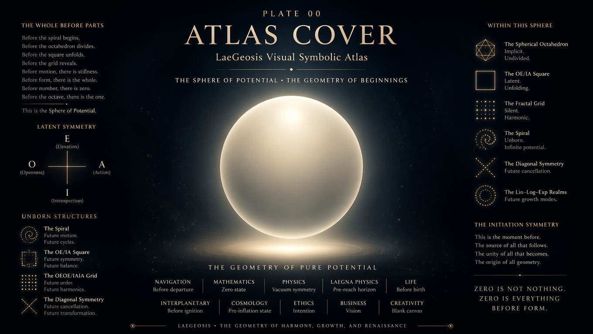

---

## Plate 01 — Spiral of Origin  
The first projection: spherical octahedron memory expressed as a spiral.  
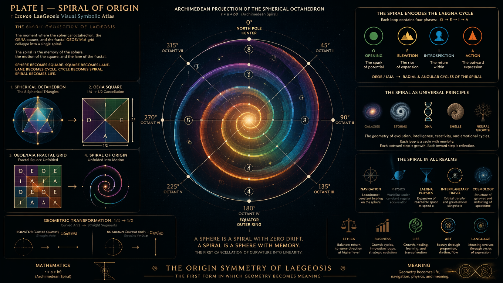

---

## Plate 02 — Archimedean Lane  
The spiral becomes motion: the lane geometry of direction and continuity.  
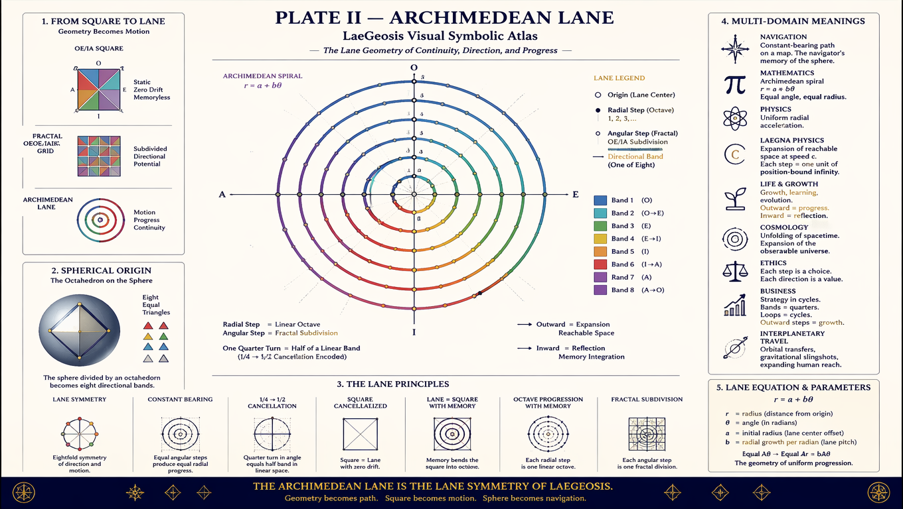

---

## Plate 03 — Cycle Grid  
The OE/IA square unfolds into harmonic cycles and temporal structure.  
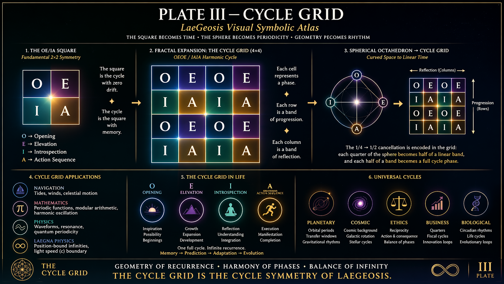

---

## Plate 04 — Spherical Octahedron  
The sphere’s perfect symmetry: eight equal regions, harmonic structure.  
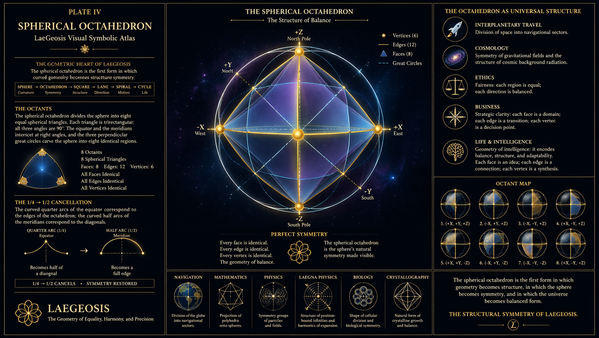

---

## Plate 05 — Diagonal Symmetry  
The cancellation geometry: 1/4 → 1/2 transformation, linear equivalence.  
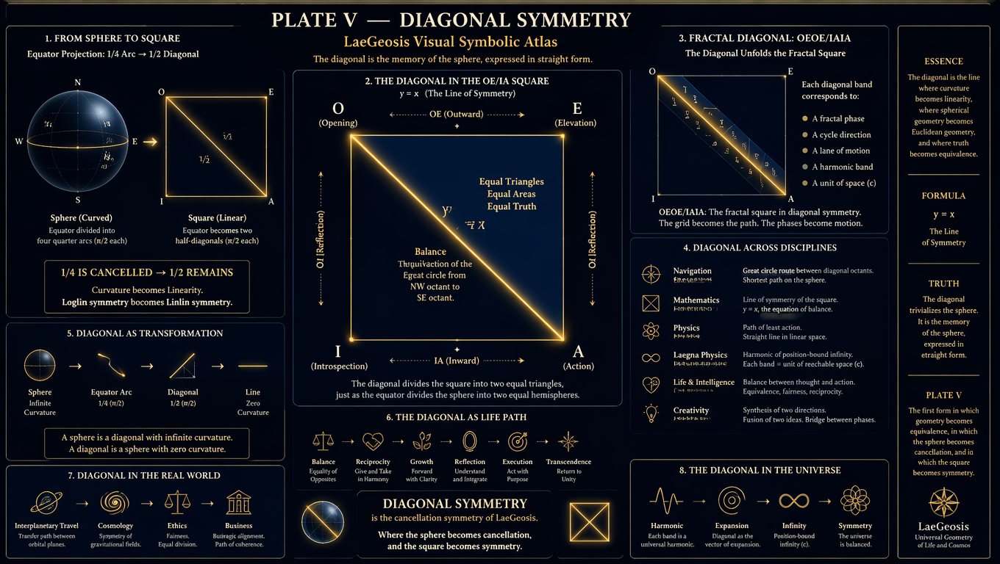

---

## Plate 06 — Lin–Log–Exp Realms  
Three growth modes unified: linear, logarithmic, exponential.  
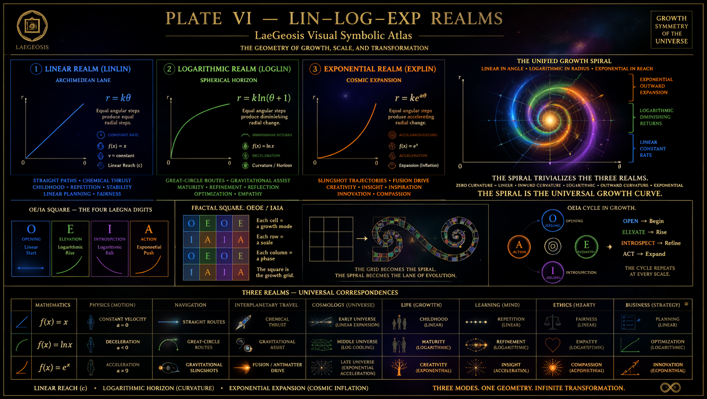

---

## Plate 07 — Social Equilibrium  
Human symmetry: OE/IA as cultural, ethical, and cooperative geometry.  
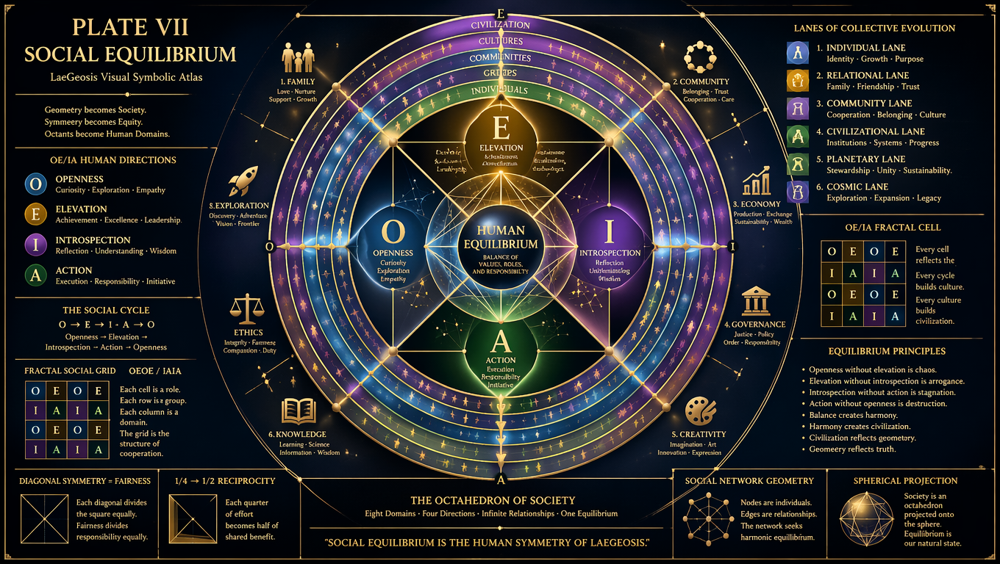

---

## Plate 08 — Interplanetary Spiral  
Orbital mechanics, gravitational corridors, cosmic navigation.  
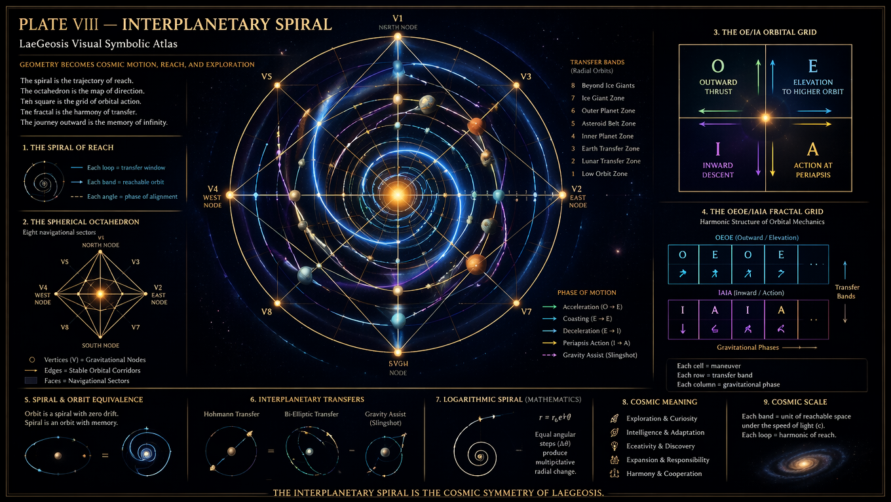

---

## Plate 09 — Earth Projection  
The biosphere as geometric equilibrium: climates, ecosystems, civilizations.  
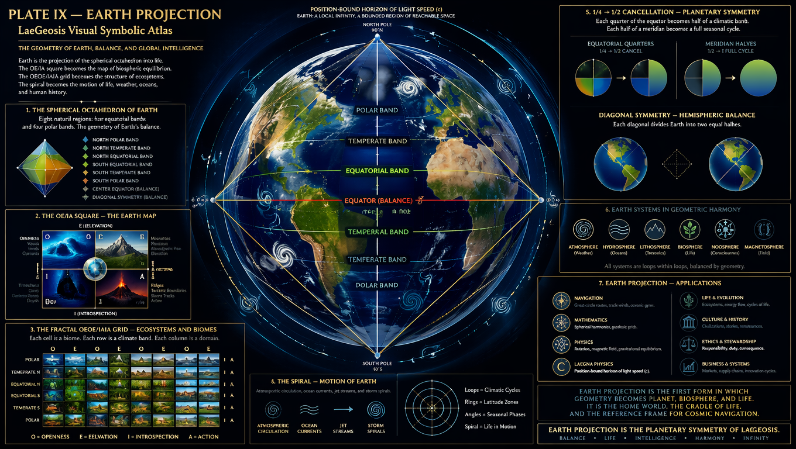

---

## Plate 10 — Universe Precision  
Cosmic symmetry: galaxies, spacetime, position‑bound infinities.  
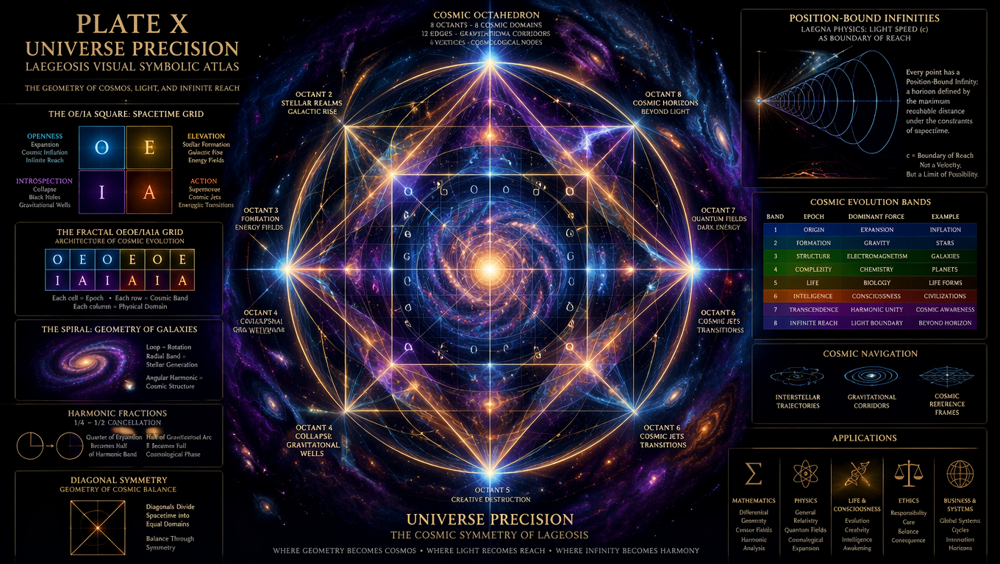

---

## Plate 11 — Life Spiral  
Evolution, biology, cognition: life as geometric continuity.  
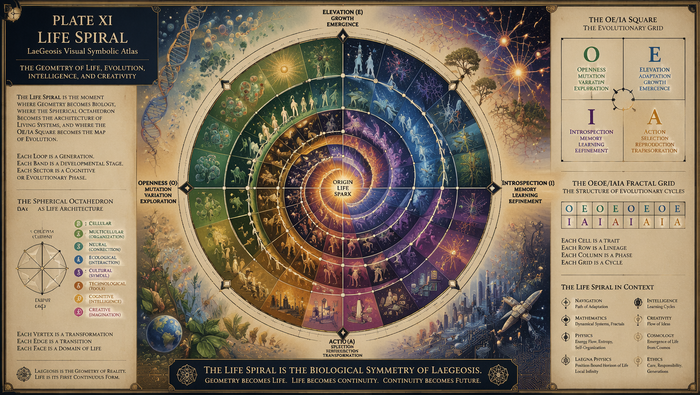

---

## Plate 12 — Intelligence & Creativity  
Mind geometry: insight, imagination, cognitive harmonics.  
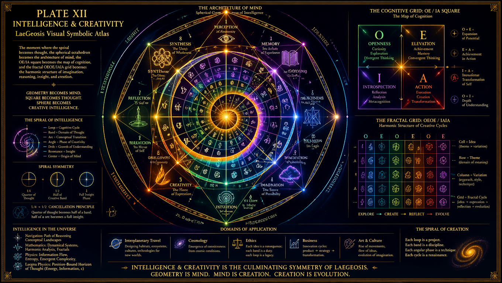

---

## Plate 13 — Next Octave  
Transcendence: the atlas expands into the next sphere, next harmonic.  
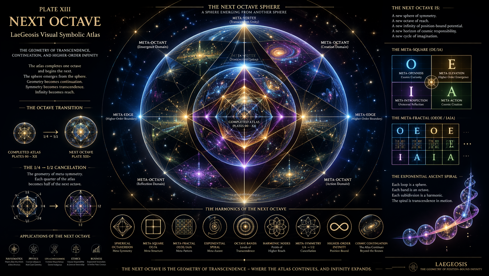

---

## About  
This atlas is part of the LaeGOS / Laegna ecosystem, expressing geometry, physics, cognition, biology, society, and cosmology through unified symbolic structures.

